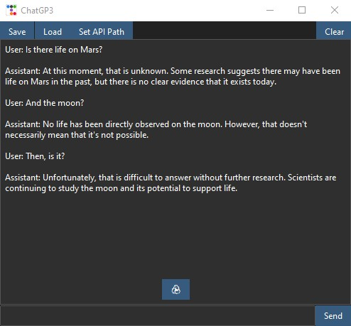

# ChatGP3

A simple chatbot program that uses OpenAI's GPT-3 API to generate responses.



## Getting Started

To use this program, you will need an OpenAI API key. You can set your API key by clicking the "Set API Path" button in the top menu of the program. Otherwise, the script will look for a file named "openai_key.txt" in the same directory as the script.

You will also need to install the required Python package for OpenAI.
```bash
pip install openai
```
If you do not have ttkbootstrap or tkinter, the same will be required for those.

```bash
pip install ttkbootstrap
pip install tkinter
```

Once you have set your API key and installed the required packages, you can run the program by running the ChatgGP3.pyw file.

## Usage

To start a conversation with the chatbot, simply type your message into the input box and hit "Enter" or click the "Send" button. The chatbot will respond with a generated message. You can regenerate the chatbot's response by clicking the "♻️" button.

You can save and load conversation histories by clicking the "Save" and "Load" buttons in the top menu. You can also clear the conversation history by clicking the "Clear" button.

## Contributing

If you have any suggestions or find any bugs, please feel free to open an issue or submit a pull request.

## License
This project is licensed under the MIT License - see the LICENSE file for details.

## Disclaimer

I am new to coding. I started this year so I expect many errors that will help me learn python further.
